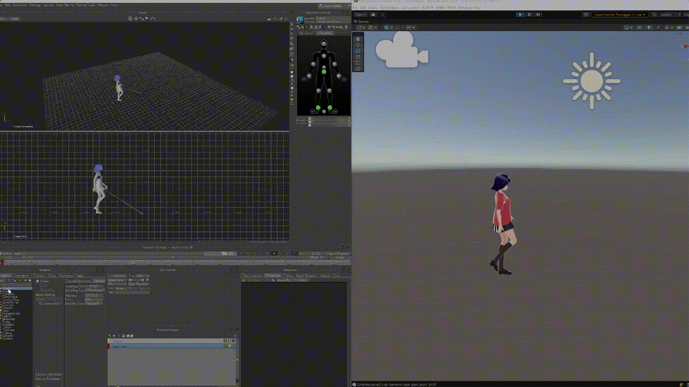

# MotionBuilder Live Sync Unity

A tool to sync characters and props from MotionBuilder to Unity in real-time.



MotionBuilder's characterized Character to Unity's Humanoid Avatar,
MotionBuilder Prop can synchronize Position and Rotation to Unity Object in real time.

## Install

Install via Unity Package Manager.

```
https://github.com/nasshu2916/MotionBuilder-Live-Sync-Unity.git?path=/Assets/MoBuLiveSync#master
```

## Home Page
[English](https://www.naoyakohda.net/mb_sync/en/)  
[日本語](https://www.naoyakohda.net/mb_sync/ja/)
